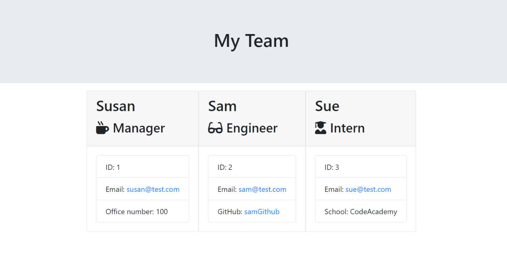

## Team Profile Generator

The main objective of the project is to create a command-line application that generates a webpage displaying a team's basic information, using Inquirer to gather information about team members and creating objects for each member using the correct classes.

## The following are the instructions to follow:

The initial category is a "Parent" class for employees that has the following characteristics and functions:
- name
- id
- email
- getName()
- getId()
- getEmail()
- getRole()—returns 'Employee'
The other three classes will extend Employee.

In addition to Employee's properties and methods, Manager will also have the following:
- officeNumber
- getRole()—overridden to return 'Manager'
- In addition to Employee's properties and methods, Engineer will also have the following:
- github—GitHub username
- getGithub()
- getRole()—overridden to return 'Engineer'

In addition to Employee's properties and methods, Intern will also have the following:
- school
- getSchool()
- getRole()—overridden to return 'Intern'

## When a user starts the application, the user is prompted to enter the team manager's:
  Name
  Employee ID
  Email address
  Office number
  When a user enters this information, the user is presented with a menu with the option to:
  Add an engineer
  Add an intern
  Finish building the team
  When a user selects the engineer option, the user is prompted to enter the following information and then taken back to the menu:
  Engineer's name
  ID
  Email
  GitHub username

## When a user selects the intern option, the user is prompted to enter the following information and then taken back to the menu:
  Intern's name
  ID
  Email
  School

When a user decides to finish building their team, the user exits the application, and the HTML is generated. When render function has passed array containing all employee objects, render funtion will generate HTML template for each employee. The HTML webpage titled "My Team" features three boxes listing employee names, titles, and other key 
info.

## Sample of the page 

## Deployed page 
https://sucaad-kulane.github.io/Team-Profile-Generator/

